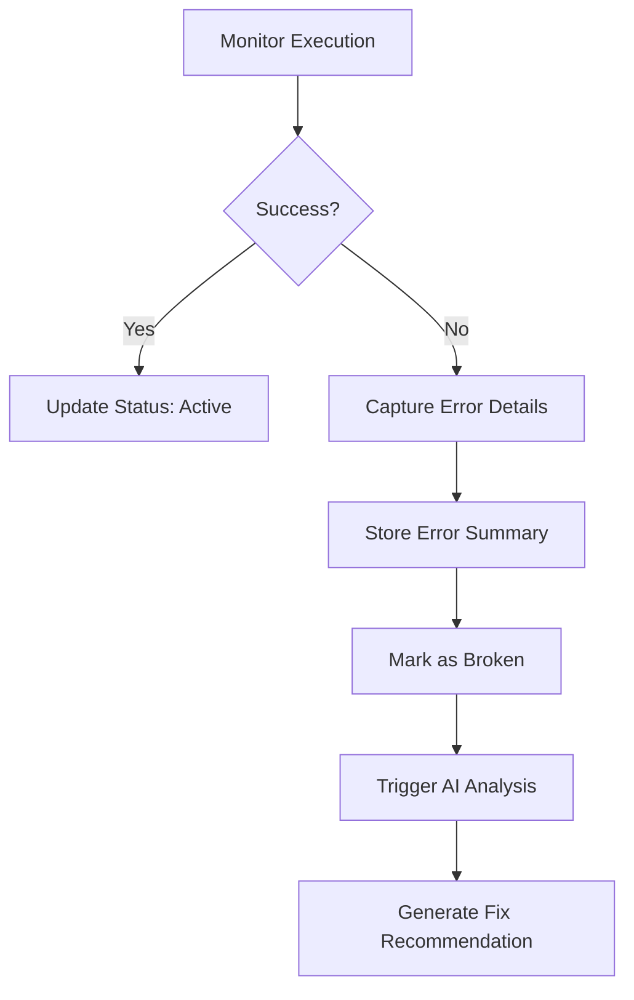
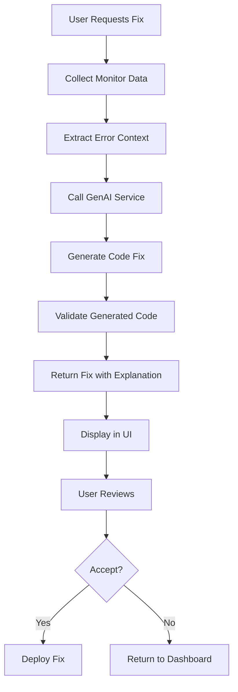

# GenAI API Implementation Guide for Monitor Dashboard

## Executive Summary

This document provides a comprehensive guide for implementing the GenAI solution into the Monitor Dashboard application. The system is designed to automatically detect, analyze, and fix broken web scrapers using AI-powered code generation and deployment automation.

## Table of Contents

1. [System Architecture](#system-architecture)
2. [Current Implementation Status](#current-implementation-status)
3. [GenAI Integration Points](#genai-integration-points)
4. [API Endpoints to Implement](#api-endpoints-to-implement)
5. [Data Flow and Processing](#data-flow-and-processing)
6. [Authentication and Security](#authentication-and-security)
7. [Error Handling and Monitoring](#error-handling-and-monitoring)
8. [Testing and Validation](#testing-and-validation)
9. [Deployment Strategy](#deployment-strategy)
10. [Performance Considerations](#performance-considerations)
11. [Future Enhancements](#future-enhancements)

---

## System Architecture

### Technology Stack

**Frontend:**
- React 19.1.0
- React Router DOM 7.6.3
- Tailwind CSS (styling)
- Axios (HTTP client)

**Backend:**
- Node.js with Express.js 4.18.2
- SQLite/MongoDB with Sequelize ORM
- JWT authentication
- CORS enabled for cross-origin requests

**Additional Dependencies:**
- `bcryptjs` for password hashing
- `helmet` for security headers
- `morgan` for request logging
- `simple-git` for Git operations
- `winston` for logging

### System Components

```
┌─────────────────────────────────────────────────────────────────┐
│                        Frontend (React)                        │
│  ┌─────────────────┐  ┌─────────────────┐  ┌─────────────────┐ │
│  │   Dashboard     │  │  AI Fix Review  │  │   Deployment    │ │
│  │   Component     │  │    Component    │  │    Review       │ │
│  └─────────────────┘  └─────────────────┘  └─────────────────┘ │
│                              │                                 │
│  ┌─────────────────┐  ┌─────────────────┐  ┌─────────────────┐ │
│  │   AI Service    │  │ Deployment Svc  │  │   Constants     │ │
│  │   (Frontend)    │  │   (Frontend)    │  │   & Utilities   │ │
│  └─────────────────┘  └─────────────────┘  └─────────────────┘ │
└─────────────────────────────────────────────────────────────────┘
                              │
                              │ HTTP/REST API
                              │
┌─────────────────────────────────────────────────────────────────┐
│                       Backend (Node.js)                        │
│  ┌─────────────────┐  ┌─────────────────┐  ┌─────────────────┐ │
│  │   AI Routes     │  │  Monitor Routes │  │ Deployment Rts  │ │
│  │ (Placeholder)   │  │  (Implemented)  │  │ (Placeholder)   │ │
│  └─────────────────┘  └─────────────────┘  └─────────────────┘ │
│                              │                                 │
│  ┌─────────────────┐  ┌─────────────────┐  ┌─────────────────┐ │
│  │   Controllers   │  │     Models      │  │   Middleware    │ │
│  │                 │  │ (Monitor, Repo) │  │                 │ │
│  └─────────────────┘  └─────────────────┘  └─────────────────┘ │
│                              │                                 │
│  ┌─────────────────┐  ┌─────────────────┐  ┌─────────────────┐ │
│  │   Database      │  │   Git Service   │  │   AI Service    │ │
│  │   (SQLite)      │  │   (GitHub/GL)   │  │   (TO IMPL)     │ │
│  └─────────────────┘  └─────────────────┘  └─────────────────┘ │
└─────────────────────────────────────────────────────────────────┘
```

---

## Current Implementation Status

### ✅ Completed Components

1. **Frontend Dashboard UI** - Fully functional
   - User authentication and role-based access
   - Monitor listing and management
   - Broken scraper visualization
   - AI fix review interface
   - Deployment confirmation workflows

2. **Backend API Infrastructure** - Partially implemented
   - Express.js server with middleware
   - Database models (Monitor, Repository)
   - Authentication system
   - Basic CRUD operations for monitors

3. **User Interface Flow** - Complete
   - Login → Dashboard → Broken Scrapers → Fix Detail → AI Review → Deployment
   - Responsive design with modern UI/UX
   - Error handling and loading states

### ❌ Missing Components (GenAI Integration Points)

1. **AI Service Backend Implementation**
2. **Deployment Service Integration**
3. **GitHub/GitLab API Integration**
4. **Real-time AI Processing**
5. **Code Validation and Testing**

---

## GenAI Integration Points

### 1. AI Fix Generation Workflow

```
User clicks "Generate AI Fix" 
    ↓
Frontend calls: POST /api/ai/generate-fix
    ↓
Backend processes:
    - Extracts monitor configuration
    - Analyzes error patterns
    - Calls GenAI service
    - Validates generated code
    - Returns fix with explanation
    ↓
Frontend displays side-by-side comparison
    ↓
User reviews and accepts/rejects
```

### 2. Key Integration Points

#### A. Error Analysis (`ScraperFixDetail.js`)
```javascript
const handleMagic = async () => {
  const result = await AIService.generateFix(scraperId, {
    errorSummary: scraper.errorSummary,
    lastAction: scraper.lastAction,
    monitorType: scraper.name
  });
  // Process result and navigate to review
};
```

#### B. Code Review (`AiFixReview.js`)
- Displays old vs new code comparison
- Shows AI explanation and confidence level
- Provides deployment validation

#### C. Deployment Process (`DeploymentService.js`)
- Creates GitHub/GitLab pull requests
- Manages deployment status
- Handles rollback operations

---

## API Endpoints to Implement

### AI Service Endpoints

#### `POST /api/ai/generate-fix`
**Purpose:** Generate AI-powered fix for broken monitor

**Request Body:**
```json
{
  "monitorId": "string",
  "errorData": {
    "errorSummary": "string",
    "lastAction": "string",
    "monitorType": "string",
    "targetUrl": "string",
    "selectors": {
      "css": ["string"],
      "xpath": ["string"]
    },
    "lastWorkingCode": "string",
    "errorLogs": ["string"]
  },
  "context": {
    "screenshotUrl": "string",
    "pageSource": "string",
    "networkLogs": ["object"]
  }
}
```

**Response:**
```json
{
  "success": true,
  "data": {
    "fixId": "string",
    "code": "string",
    "explanation": "string",
    "confidence": 0.95,
    "estimatedTime": "2-3 minutes",
    "changes": [
      {
        "type": "selector_update",
        "old": "#transactionsTable",
        "new": "#bankTransactions",
        "reason": "Element ID changed in new page structure"
      }
    ],
    "validationResults": {
      "syntaxValid": true,
      "compatibilityCheck": true,
      "securityScan": true
    }
  },
  "message": "AI fix generated successfully"
}
```

#### `POST /api/ai/analyze-error`
**Purpose:** Deep analysis of monitor errors

**Request Body:**
```json
{
  "monitorId": "string",
  "errorLogs": ["string"],
  "screenshotData": "base64_string",
  "pageSource": "string",
  "networkActivity": ["object"]
}
```

**Response:**
```json
{
  "success": true,
  "data": {
    "rootCause": "string",
    "errorCategory": "selector_change|timeout|authentication|structure_change",
    "affectedElements": ["string"],
    "recommendations": ["string"],
    "severity": "low|medium|high",
    "fixComplexity": "simple|moderate|complex"
  }
}
```

### Deployment Service Endpoints

#### `POST /api/deployments/create`
**Purpose:** Create deployment for AI-generated fix

**Request Body:**
```json
{
  "monitorId": "string",
  "fixId": "string",
  "repositoryId": "string",
  "branchName": "string",
  "commitMessage": "string",
  "deploymentType": "pull_request|direct_commit"
}
```

**Response:**
```json
{
  "success": true,
  "data": {
    "deploymentId": "string",
    "prUrl": "string",
    "status": "pending|in_progress|completed|failed",
    "steps": [
      {
        "name": "string",
        "status": "pending|running|completed|failed",
        "timestamp": "ISO_date"
      }
    ]
  }
}
```

---

## Data Flow and Processing

### 1. Monitor Health Check Process



### 2. AI Fix Generation Process



### 3. Database Schema

#### Monitor Table
```sql
CREATE TABLE monitors (
    id INTEGER PRIMARY KEY AUTOINCREMENT,
    name VARCHAR(255) NOT NULL,
    description TEXT,
    target_url VARCHAR(255) NOT NULL,
    monitor_type ENUM('web_scraping', 'api_monitoring', 'price_tracking'),
    status ENUM('active', 'inactive', 'broken', 'maintenance'),
    selectors TEXT, -- JSON
    repository_id INTEGER,
    last_check DATETIME,
    error_summary TEXT,
    created_at DATETIME,
    updated_at DATETIME
);
```

#### AI Fix History Table (New)
```sql
CREATE TABLE ai_fixes (
    id INTEGER PRIMARY KEY AUTOINCREMENT,
    monitor_id INTEGER NOT NULL,
    fix_code TEXT NOT NULL,
    explanation TEXT,
    confidence DECIMAL(3,2),
    status ENUM('generated', 'reviewed', 'deployed', 'failed'),
    deployment_id INTEGER,
    created_at DATETIME,
    FOREIGN KEY (monitor_id) REFERENCES monitors(id)
);
```

---

## Authentication and Security

### Current Authentication System

The system uses JWT-based authentication with role-based access control:

- **Admin Role**: Full access to all features
- **Operator Role**: Limited access to monitoring and fixes

### Security Considerations for GenAI Integration

1. **Input Validation**
   - Sanitize all user inputs before sending to AI service
   - Validate generated code for security vulnerabilities
   - Prevent code injection attacks

2. **Rate Limiting**
   - Implement rate limiting for AI service calls
   - Prevent abuse of expensive AI operations

3. **Access Control**
   - Restrict AI fix generation to authorized users
   - Log all AI service interactions for audit

4. **Code Safety**
   - Validate generated code syntax
   - Scan for potential security issues
   - Sandbox testing environment

---

## Error Handling and Monitoring

### Error Categories

1. **AI Service Errors**
   - Service unavailable
   - Invalid response format
   - Timeout errors
   - Rate limit exceeded

2. **Code Generation Errors**
   - Syntax errors in generated code
   - Logic errors
   - Compatibility issues

3. **Deployment Errors**
   - Git repository access issues
   - Merge conflicts
   - CI/CD pipeline failures

### Monitoring and Logging

```javascript
// Example error handling structure
const errorHandler = {
  aiService: {
    timeout: 30000,
    retryAttempts: 3,
    fallbackResponse: "AI service temporarily unavailable"
  },
  deployment: {
    timeout: 60000,
    retryAttempts: 2,
    rollbackOnFailure: true
  }
};
```

---

## Testing and Validation

### Testing Strategy

1. **Unit Tests**
   - Test AI service integration
   - Validate code generation logic
   - Test deployment workflows

2. **Integration Tests**
   - End-to-end workflow testing
   - API endpoint testing
   - Database integration tests

3. **AI Model Testing**
   - Code quality validation
   - Fix accuracy measurement
   - Performance benchmarking

### Validation Framework

```javascript
// Code validation example
const validateGeneratedCode = async (code) => {
  const results = {
    syntaxValid: await validateSyntax(code),
    securityScan: await scanForVulnerabilities(code),
    compatibilityCheck: await checkCompatibility(code),
    performanceScore: await analyzePerformance(code)
  };
  return results;
};
```

---

## Deployment Strategy

### Environment Configuration

#### Development Environment
```env
# AI Service Configuration
AI_SERVICE_URL=http://localhost:8000
AI_SERVICE_API_KEY=dev_key_12345
AI_SERVICE_TIMEOUT=30000

# Deployment Configuration
GITHUB_TOKEN=ghp_xxxxxxxxxxxx
GITLAB_TOKEN=glpat_xxxxxxxxxxxx
DEPLOYMENT_TIMEOUT=60000
```

#### Production Environment
```env
# AI Service Configuration
AI_SERVICE_URL=https://api.ai-service.com
AI_SERVICE_API_KEY=prod_key_secure
AI_SERVICE_TIMEOUT=45000

# Deployment Configuration
GITHUB_TOKEN=ghp_prod_token
GITLAB_TOKEN=glpat_prod_token
DEPLOYMENT_TIMEOUT=120000
```

### Deployment Pipeline

1. **Code Generation**
   - AI service generates fix
   - Validate generated code
   - Store in database

2. **Review Process**
   - User reviews AI-generated fix
   - Side-by-side comparison
   - Approval workflow

3. **Deployment Execution**
   - Create Git branch
   - Commit changes
   - Create pull request
   - Notify stakeholders

---

## Performance Considerations

### AI Service Performance

1. **Response Time Optimization**
   - Cache common fix patterns
   - Implement request queuing
   - Use asynchronous processing

2. **Resource Management**
   - Monitor API usage
   - Implement connection pooling
   - Handle concurrent requests

### Database Performance

1. **Query Optimization**
   - Index critical fields
   - Optimize complex queries
   - Implement caching

2. **Data Management**
   - Archive old fix history
   - Implement data retention policies
   - Monitor database size

---

## Future Enhancements

### Phase 1: Core GenAI Integration
- Implement basic AI fix generation
- Add code validation
- Create deployment workflow

### Phase 2: Advanced Features
- Multi-language support
- Complex error pattern recognition
- Automated testing integration

### Phase 3: Enterprise Features
- Advanced analytics
- Custom AI model training
- Enterprise integrations

### Phase 4: Scaling and Optimization
- Microservices architecture
- Performance optimization
- Advanced monitoring

---

## Implementation Checklist

### Backend Implementation

- [ ] Create AI service controller
- [ ] Implement GenAI API integration
- [ ] Add code validation logic
- [ ] Create deployment service
- [ ] Implement GitHub/GitLab API
- [ ] Add error handling and logging
- [ ] Create database migrations
- [ ] Add comprehensive tests

### Frontend Updates

- [ ] Update AI service integration
- [ ] Add real-time status updates
- [ ] Implement error handling
- [ ] Add loading states
- [ ] Create admin configuration panel
- [ ] Add analytics dashboard

### DevOps and Deployment

- [ ] Set up CI/CD pipeline
- [ ] Configure environment variables
- [ ] Set up monitoring and alerting
- [ ] Create deployment documentation
- [ ] Implement backup and recovery

---

## Contact and Support

For questions regarding this implementation guide or the GenAI integration:

- **Technical Lead**: Review system architecture and API design
- **AI Team**: Consult on AI service integration and model selection
- **DevOps Team**: Coordinate deployment and infrastructure setup
- **QA Team**: Validate testing strategy and quality assurance

---

## Appendix

### A. API Response Examples

#### Successful AI Fix Generation
```json
{
  "success": true,
  "data": {
    "fixId": "fix_1642567890",
    "code": "# AI-generated Python code...",
    "explanation": "The website updated their selector...",
    "confidence": 0.92,
    "estimatedTime": "2-3 minutes",
    "changes": [
      {
        "type": "selector_update",
        "old": ".old-selector",
        "new": ".new-selector",
        "reason": "Element class name changed"
      }
    ]
  }
}
```

#### Error Response
```json
{
  "success": false,
  "error": "AI service temporarily unavailable",
  "details": "Connection timeout after 30 seconds",
  "retryAfter": 300,
  "errorCode": "AI_SERVICE_TIMEOUT"
}
```

### B. Configuration Templates

#### AI Service Configuration
```javascript
const aiConfig = {
  baseUrl: process.env.AI_SERVICE_URL,
  apiKey: process.env.AI_SERVICE_API_KEY,
  timeout: parseInt(process.env.AI_SERVICE_TIMEOUT) || 30000,
  retryAttempts: 3,
  models: {
    codeGeneration: "gpt-4-code",
    errorAnalysis: "claude-3-opus",
    validation: "codex-davinci"
  }
};
```

#### Deployment Configuration
```javascript
const deploymentConfig = {
  github: {
    token: process.env.GITHUB_TOKEN,
    baseUrl: "https://api.github.com",
    timeout: 60000
  },
  gitlab: {
    token: process.env.GITLAB_TOKEN,
    baseUrl: "https://gitlab.com/api/v4",
    timeout: 60000
  },
  defaultBranch: "main",
  prTemplate: "fix-monitor-{monitorId}-{timestamp}"
};
```

---

*This document serves as a comprehensive guide for implementing the GenAI solution into the Monitor Dashboard application. Regular updates will be made as the implementation progresses.*